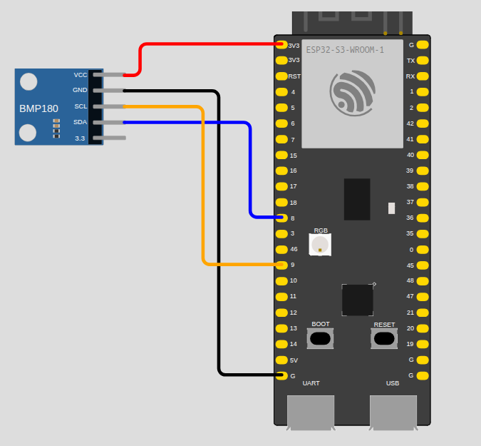
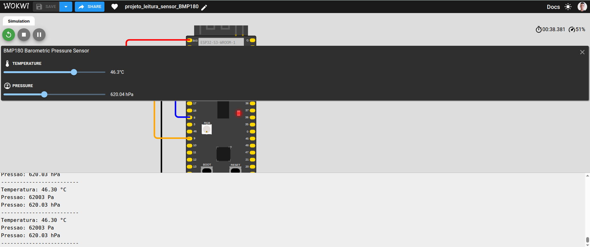
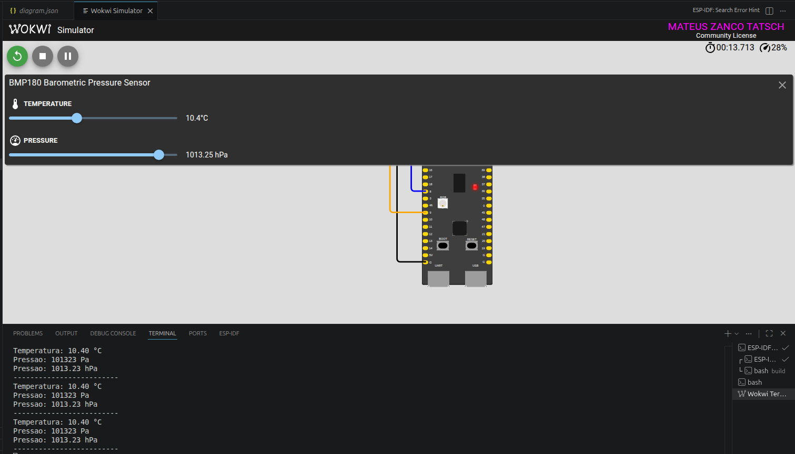

# BMP180 Sensor Reading

ESP-IDF project for reading temperature and atmospheric pressure from a BMP180 sensor connected to an ESP32-S3 board over I2C. The project also includes Wokwi simulation files.

## Features

- Initializes the I2C bus on the ESP32-S3.
- Detects the BMP180 sensor through its identification register.
- Reads the BMP180 internal calibration coefficients.
- Calculates temperature in degrees Celsius.
- Calculates atmospheric pressure in Pa and hPa.
- Prints readings to the serial monitor every 1 second.

## Hardware

| Component | Connection |
| --- | --- |
| ESP32-S3 GPIO 8 | BMP180 SDA |
| ESP32-S3 GPIO 9 | BMP180 SCL |
| ESP32-S3 3V3 | BMP180 VCC |
| ESP32-S3 GND | BMP180 GND |

Configuration used in the code:

```c
#define I2C_PORT I2C_NUM_0
#define SDA_PIN  8
#define SCL_PIN  9
#define I2C_FREQ 100000
```

### Circuit



## Project Structure

```text
leitura_sensor_bmp180/
├── CMakeLists.txt
├── LICENSE
├── diagram.json
├── wokwi.toml
├── images/
│   ├── circuit.png
│   ├── circuit_wokwi.png
│   ├── simulation_wokwi.png
│   ├── simulation_wokwi_vs_code.png
│   └── simulation_wokwi_vs_code_01.png
└── main/
    ├── CMakeLists.txt
    └── main.c
```

## Prerequisites

- ESP-IDF installed and configured in your terminal.
- ESP32-S3 board or Wokwi simulator.
- BMP180 sensor.

To configure the ESP-IDF environment, run the export script from your installation before building:

```bash
. $IDF_PATH/export.sh
```

## Build

From the project directory:

```bash
cd leitura_sensor_bmp180
idf.py build
```

## Flash to the Board

Connect the ESP32-S3 over USB and run:

```bash
idf.py -p /dev/ttyUSB0 flash monitor
```

If your serial port is different, replace `/dev/ttyUSB0` with the correct port.

## Wokwi Simulation

The project includes these files:

- `diagram.json`: circuit with ESP32-S3 and BMP180.
- `wokwi.toml`: configuration for the firmware and ELF files generated by ESP-IDF.

Recommended flow:

```bash
idf.py build
wokwi-cli .
```

You can also open the project with the Wokwi extension in VS Code using `diagram.json` and `wokwi.toml`.

### Wokwi Simulation



### Wokwi Simulation in VS Code



## Expected Output

In the serial monitor, the application should print output similar to:

```text
Iniciando ESP32-S3 com BMP180...
ID do BMP180: 0x55
BMP180 encontrado!
Temperatura: 24.50 °C
Pressao: 101325 Pa
Pressao: 1013.25 hPa
-------------------------
```

## License

This project is licensed under the MIT License. See [LICENSE](LICENSE).
